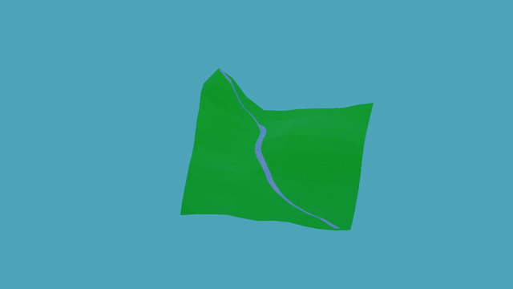

### Unstructured ideas

The player controls a river, for example through terraforming the terrain. Then, things develop around it, such as villages, fields, forests, wetlands, deltas, ravines, all depending on the surroundings.

The game should be centered around two phases. One where you look for the sea, starting up in some mountain, becoming larger as you stream downwards, and you get to control how it is to flow. Sometimes, the current will be strong, sometimes it turns into a waterfall, sometimes lakes form, etc. The terrain should be procedurally generated so it is different every time, and different types of rock and soil should affect the river and be affected by the river.

The next phase is to control the river after it reaches the sea. For example through some small changes to the environment that makes the river change. Sometimes a small change might get out of control and cause a larger change later on. This should be sort of a sandbox mode, where your success depends on the success of the river's surroundings. If you would like to, you could destroy everything, kind of like in Sim City or Cities: Skylines.

One idea might be to use metaballs to form the flowing water. Another could be to find the gradient in some points on the terrain mesh and form a path that is projected down onto the mesh, whereupon the water is rendered around the path somehow.

The graphics could be low-poly in a nice, stylized way. Pastel colors could look nice. Half-top down with an orthographic camera would probably fit well. A graphics style kind of like Poly Bridge is what I am imagining. Something like in the mockup animation below:

No god mode (potentially there could be a god mode if it is wanted), there should be some kind of currency that you need in order to make changes. Changes should include making the soil/earth/rock different, changing height of terrain etc.

There could be a mode with scenarios, where there is a certain kind of map, and there is a challenge to reach a certain degree of e.g. prosperity or population.
